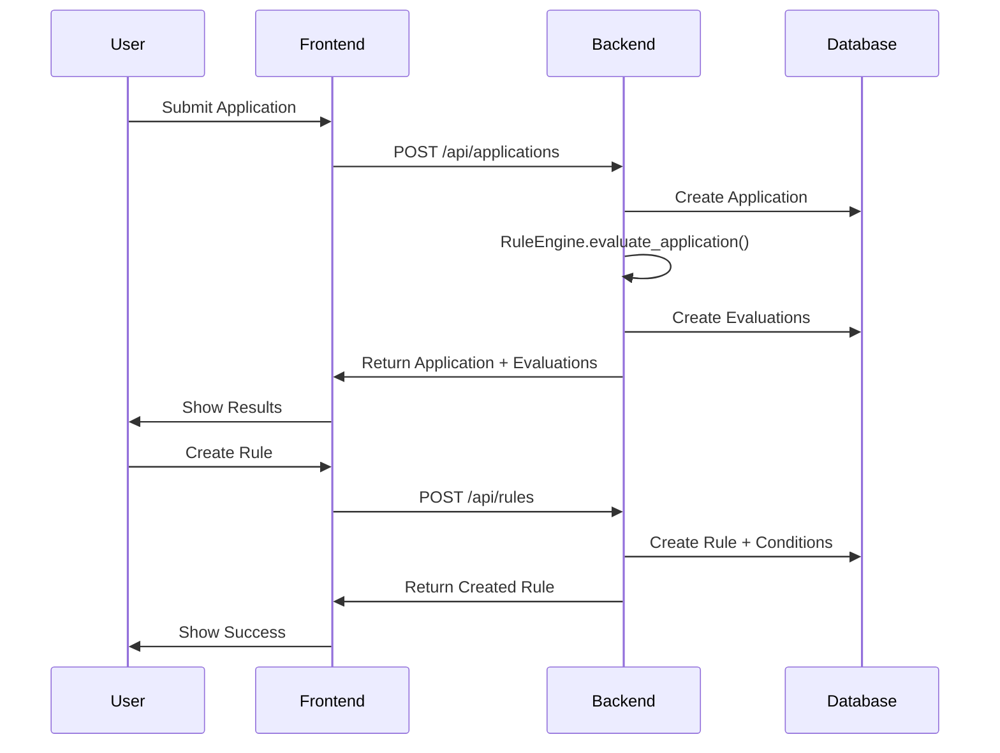
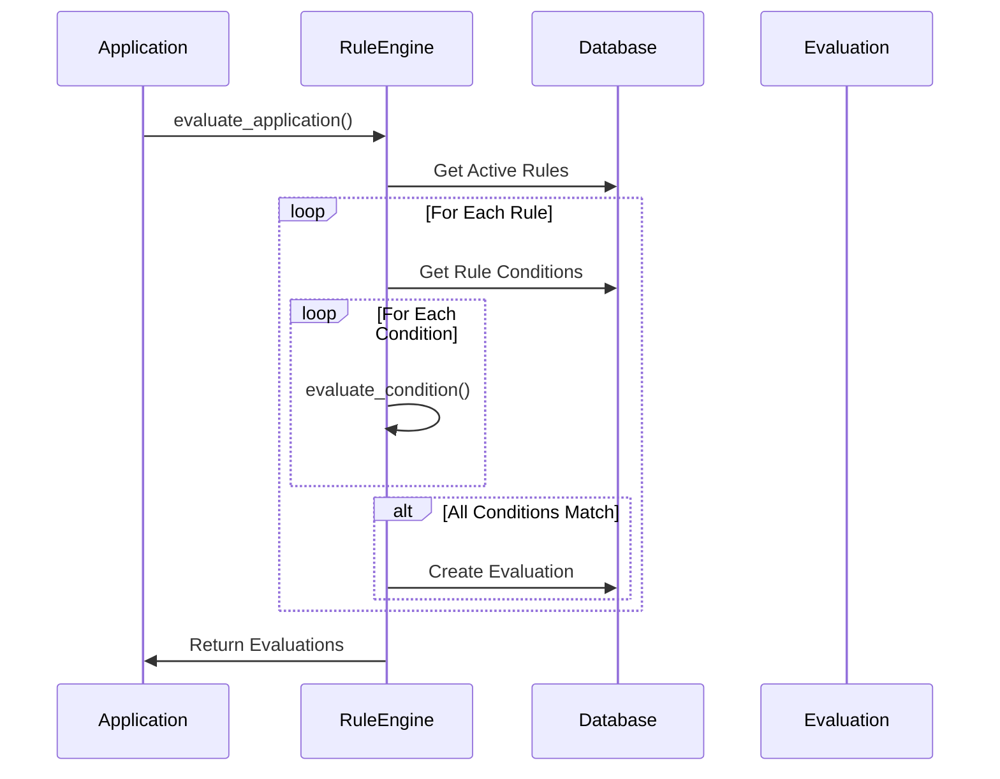

# Rules Automation App Architecture

## Database Schema

### Core Tables

1. **applications**

   ```sql
   CREATE TABLE applications (
       id SERIAL PRIMARY KEY,
       applicant_name VARCHAR NOT NULL,
       applicant_email VARCHAR NOT NULL,
       family_status VARCHAR,
       business_owner BOOLEAN,
       filed_us_taxes BOOLEAN,
       tax_year INTEGER,
       submitted_at TIMESTAMP,
       created_at TIMESTAMP DEFAULT CURRENT_TIMESTAMP,
       updated_at TIMESTAMP DEFAULT CURRENT_TIMESTAMP
   );
   ```

2. **rules**

   ```sql
   CREATE TABLE rules (
       id SERIAL PRIMARY KEY,
       name VARCHAR UNIQUE,
       description TEXT,
       is_active BOOLEAN DEFAULT TRUE,
       action VARCHAR,  -- Document type to request
       action_description TEXT,
       created_at TIMESTAMP DEFAULT CURRENT_TIMESTAMP,
       updated_at TIMESTAMP DEFAULT CURRENT_TIMESTAMP
   );
   ```

3. **condition_types**

   ```sql
   CREATE TABLE condition_types (
       id SERIAL PRIMARY KEY,
       name VARCHAR UNIQUE,
       field VARCHAR UNIQUE,
       description TEXT,
       data_type VARCHAR,
       options JSONB,
       year_field VARCHAR
   );
   ```

4. **rule_conditions** (Association Table)

   ```sql
   CREATE TABLE rule_conditions (
       rule_id INTEGER REFERENCES rules(id),
       condition_type_id INTEGER REFERENCES condition_types(id),
       value VARCHAR,
       year INTEGER,
       PRIMARY KEY (rule_id, condition_type_id)
   );
   ```

5. **evaluations**
   ```sql
   CREATE TABLE evaluations (
       id SERIAL PRIMARY KEY,
       application_id INTEGER REFERENCES applications(id),
       rule_id INTEGER REFERENCES rules(id),
       action_taken VARCHAR,
       evaluated_at TIMESTAMP DEFAULT CURRENT_TIMESTAMP,
       created_at TIMESTAMP DEFAULT CURRENT_TIMESTAMP,
       updated_at TIMESTAMP DEFAULT CURRENT_TIMESTAMP
   );
   ```

## System Architecture

### Frontend/Backend Interaction



### Rule Evaluation Flow



## Component Design

### Backend Components

1. **RuleEngine Service**

   - Core business logic for rule evaluation
   - Handles condition evaluation and document request generation
   - Synchronous evaluation during application submission

2. **API Routes**

   - `/api/applications` - Application submission and retrieval
   - `/api/rules` - Rule management
   - `/api/condition-types` - Condition type management

3. **Database Models**
   - SQLAlchemy models with relationships
   - Pydantic schemas for request/response validation

### Frontend Components

1. **Application Form**

   - Form for application submission
   - Real-time validation
   - Display of evaluation results

2. **Rule Management**

   - Rule creation/editing interface
   - Condition type selection
   - Rule activation/deactivation

3. **Dashboard**
   - Overview of applications and rules
   - Evaluation history
   - Document request status

## Technical Considerations

1. **Database**

   - PostgreSQL for robust data storage
   - Alembic for schema migrations
   - Indexes on frequently queried fields

2. **API Design**

   - RESTful endpoints
   - Pydantic for request/response validation
   - Clear separation of concerns

3. **Rule Evaluation**

   - Synchronous evaluation for immediate feedback
   - Extensible condition types
   - Clear audit trail through evaluations

4. **Security**
   - Input validation at API level
   - SQL injection prevention through SQLAlchemy
   - Data sanitization in frontend

## Future Considerations

1. **Scalability**

   - Async rule evaluation for high load
   - Caching of frequently used rules
   - Batch processing capabilities

2. **Extensibility**

   - Support for new action types
   - Custom condition type definitions
   - Rule priority system

3. **Monitoring**
   - Performance metrics
   - Error tracking
   - Usage analytics

This prototype demonstrates a clean separation of concerns between API routing, business logic, and data persistence.
It includes full unit test coverage for the core RuleEngine logic, ensuring reliable business behavior even as the system evolves.

The current architecture is designed for quick iteration and future scalability:

- 🔧 Easily extendable to support new condition types and actions.
- 📈 Designed with observability in mind through evaluation audit records.
- 🛡️ Built using secure API patterns and validated data models.
